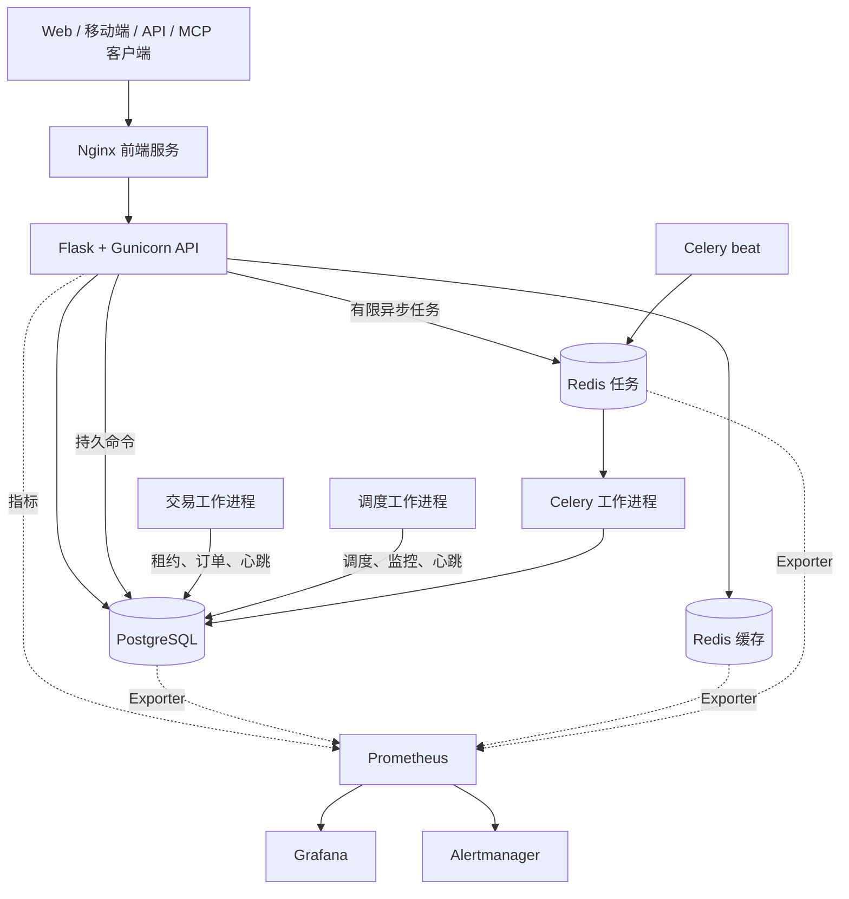
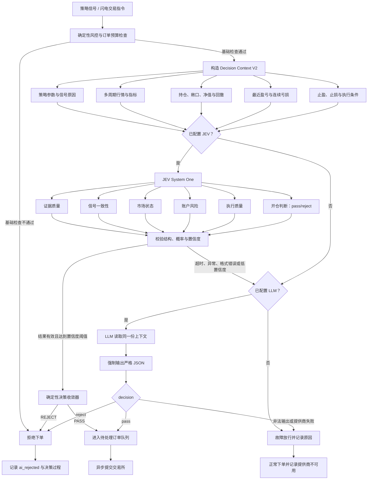

<div align="center">
  <a href="https://github.com/OpenByteInc/QuantDinger">
    
  </a>

  <h1>QuantDinger</h1>
  <p><strong>开源 AI 交易操作系统</strong></p>
  <p>在一套可自行托管的系统中，将交易想法转化为 Python 策略、回测、模拟交易、实盘执行与监控。</p>
  <p><strong>QuantDinger 是 Open Byte Inc. 旗下产品。</strong></p>
  <p><em>AI 投研 → 策略代码 → 回测 → 模拟/实盘执行 → 监控</em></p>

  <p>
    <a href="README.md"><strong>English</strong></a>
    ·
    <a href="README_CN.md"><strong>简体中文</strong></a>
    ·
    <a href="docs/api/README.md"><strong>API 文档</strong></a>
    ·
    <a href="docs/agent/README.md"><strong>AI Agent 与 MCP</strong></a>
  </p>

  <p>
    <a href="https://ai.quantdinger.com"><strong>在线应用</strong></a>
    ·
    <a href="https://www.quantdinger.com"><strong>官方网站</strong></a>
    ·
    <a href="#观看-quantdinger-实际运行"><strong>视频演示</strong></a>
    ·
    <a href="mailto:support@quantdinger.com"><strong>官方支持邮箱</strong></a>
  </p>

  <p>
    <a href="https://t.me/quantdinger"></a>
    <a href="https://discord.com/invite/tyx5B6TChr"></a>
    <a href="https://youtube.com/@quantdinger"></a>
    <a href="https://x.com/QuantDinger_EN"></a>
  </p>

  <p>
    <a href="LICENSE"></a>
    
    
    
    <a href="#jev-驱动的交易前决策"></a>
    
    <a href="https://github.com/OpenByteInc/QuantDinger/releases/latest"></a>
  </p>

  <p>
    <a href="https://github.com/orgs/OpenByteInc/projects/1"></a>
    <a href="https://github.com/orgs/OpenByteInc/projects/1/views/4"></a>
  </p>

  <p><sub>赞助支持</sub></p>
  <p>
    <a href="https://www.atlascloud.ai/?utm_source=github&utm_medium=link&utm_campaign=quantdinger" title="Atlas Cloud — AI inference sponsor">
      <picture>
        <source media="(prefers-color-scheme: dark)" srcset="https://www.atlascloud.ai/logo-white.svg">
        
      </picture>
    </a>
    &nbsp;&nbsp;&nbsp;&nbsp;
    <a href="https://aws.amazon.com/" title="Amazon Web Services — cloud infrastructure sponsor">
      <picture>
        <source media="(prefers-color-scheme: dark)" srcset="https://a0.awsstatic.com/libra-css/images/logos/aws_smile-header-desktop-en-white_59x35.png">
        
      </picture>
    </a>
  </p>
</div>

> **想参与贡献？** 请查看[公开路线图](https://github.com/orgs/OpenByteInc/projects/1)，
> 或从[等待贡献者认领的任务](https://github.com/orgs/OpenByteInc/projects/1/views/4)中认领一个范围明确的任务。

> 明确启用实盘交易后，QuantDinger 可以提交真实订单。请先从模拟交易开始，使用权限受限的
> API Key，并检查您所在司法辖区的风险与合规要求。本项目不提供投资建议。

## 观看 QuantDinger 实际运行

<p align="center">
  
</p>

## QuantDinger 是什么

QuantDinger 是面向独立交易者、Python 策略开发者和小型团队的**开源 AI 交易操作系统**。
其本地优先、可自行托管的设计，让行情数据、策略代码、券商凭据和部署始终由运营者掌控。

本项目整合了：

- 支持多家提供商的 AI 市场研究与分析；
- Python 指标和 Strategy API V2 策略开发；
- 服务端回测与实验工作流；
- 覆盖加密货币交易所和传统券商的模拟及实盘执行；
- Web、移动 H5、Human API、Agent Gateway 与 MCP 接入；
- 由 PostgreSQL 持久化的状态、可靠工作进程、审计日志和可选监控。

它不是黑盒信号服务。策略代码、风险设置、凭据和部署始终由运营者掌控。

## v5 的变化

v5 后端按照明确的运行时和运维边界组织：

- HTTP API 不再承载长期运行的交易循环或调度循环；
- 交易、调度、Celery 任务和迁移分别在独立进程中运行；
- Celery 处理有限、可重试的工作，长期运行的策略实例则保留在交易工作进程中；
- 缓存 Redis 与持久任务 Redis 使用独立实例和不同的淘汰策略；
- 高风险 API 合同通过 OpenAPI 表达并由测试保护；
- 可选的可观测性叠加配置提供 JSON 日志、请求 ID、Prometheus 指标、仪表盘和告警规则；
- 生产环境叠加配置使用非 root 用户运行后端进程，并启用只读根文件系统、移除系统能力及资源限制；
- CI 检查语法、代码规范、测试、发布门禁、Compose 文件、依赖、源码安全、密钥、API 兼容性、版本漂移和文本编码。

源码版本声明在 [`VERSION`](VERSION) 中。Git 发布标签使用相同的语义化版本并添加 `v` 前缀，
例如 `v5.0.1`。

## 系统架构

<p align="center">
  
</p>

<p align="center"><sub>可编辑源文件：<a href="docs/screenshots/architecture-v5.svg">architecture-v5.svg</a>。</sub></p>

上图展示完整的产品与流程架构。下面的运行时拓扑重点说明容器之间的职责归属和数据流。



同一个后端镜像由多个容器复用，各容器执行不同命令：

| 进程 | 职责 |
| --- | --- |
| `migration` | 应用数据库结构，并在应用服务启动前退出。 |
| `backend` | 处理 HTTP、身份认证、参数校验和持久命令提交。 |
| `trading-worker` | 管理策略运行实例、待处理订单、券商会话和对账。 |
| `scheduler-worker` | 运行投资组合、部署、支付和信号调度。 |
| `celery-worker` | 执行有限的 AI、回测、实验、报告和维护任务。 |
| `celery-beat` | 分发周期性 Celery 任务。 |

有关职责归属规则，请参阅[后端进程职责](docs/architecture/PROCESS_ROLES_AND_TASKS.md)、
[系统架构](docs/architecture/ARCHITECTURE.md)和[并发模型](docs/architecture/CONCURRENCY_MODEL.md)。

## 快速开始

### 方案 A：预构建镜像

前置要求：安装支持 Compose v2 的 Docker。无需安装 Node.js 或本地 Python 环境。

Linux 或 macOS：

```bash
curl -fsSL https://raw.githubusercontent.com/OpenByteInc/QuantDinger/main/install.sh | bash
```

Windows PowerShell：

```powershell
irm https://raw.githubusercontent.com/OpenByteInc/QuantDinger/main/install.ps1 | iex
```

安装程序会要求设置初始管理员凭据，生成所需密钥，下载 GHCR Compose 服务栈并启动。

打开：

- Web：<http://127.0.0.1:8888>
- 移动 H5：<http://127.0.0.1:8889>
- API 健康检查：<http://127.0.0.1:5000/api/health>

### Docker 管理员与设置说明

详细指南：[English](docs/deployment/ADMIN_AND_SETTINGS_TROUBLESHOOTING_EN.md) |
[中文](docs/deployment/ADMIN_AND_SETTINGS_TROUBLESHOOTING_CN.md)

对于全新数据库，后端根据 `ADMIN_USER`、`ADMIN_PASSWORD` 和可选的 `ADMIN_EMAIL`
创建初始管理员。密码始终以哈希形式存储，绝不保存明文。已有 PostgreSQL 数据卷不会被覆盖：
仅当显式配置非默认管理员时，后端才会替换从未修改过的旧版 `quantdinger` / `123456`
管理员。系统绝不会覆盖已经修改过密码的账户，也不会将已经使用目标用户名的现有账户提升为管理员。

手动 Docker 部署仅在管理员变量仍为默认值时，为兼容旧版本保留 `quantdinger` / `123456`。
该凭据不适用于面向互联网的部署；请在首次启动前或首次登录后立即修改。单命令安装程序不允许
将 `123456` 设置为密码。

设置页面会将运行时配置写入 `/app/.env`。在 GHCR 服务栈中，它对应宿主机的 `backend.env`；
在源码部署中，它对应 `backend_api_python/.env`。当前后端镜像会自动把文件所有者设置为运行时
UID `10001`，并保持权限模式 `600`。请勿使用 `chmod 755` 或递归 `777`：这些文件包含密码和
API Key，而且当文件归 root 所有时，`755` 仍不会赋予 UID `10001` 写入权限。

使用以下命令验证写入权限：

```bash
docker compose exec -u 10001:10001 -T backend \
  sh -c 'test -w /app/.env && echo writable=yes || echo writable=no'
```

加固后的生产环境叠加配置会有意以只读方式挂载 `/app/.env`。使用
`docker-compose.production.yml` 时，请在宿主机上管理配置并重新创建服务，不要从设置页面保存。
有关旧镜像恢复和 rootless/NFS 说明，请参阅[英文指南](docs/deployment/ADMIN_AND_SETTINGS_TROUBLESHOOTING_EN.md)
或[中文指南](docs/deployment/ADMIN_AND_SETTINGS_TROUBLESHOOTING_CN.md)。

### 方案 B：检出源码

```bash
git clone https://github.com/OpenByteInc/QuantDinger.git
cd QuantDinger
cp backend_api_python/env.example backend_api_python/.env
cp .env.example .env
```

首次启动前，请替换两个环境文件中的示例值：

| 文件 | 生产环境必填项 |
| --- | --- |
| `backend_api_python/.env` | `SECRET_KEY`, `CREDENTIAL_ENCRYPTION_KEY`, `ADMIN_USER`, `ADMIN_PASSWORD` |
| `.env` | `POSTGRES_PASSWORD`, `REDIS_PASSWORD`, `CELERY_REDIS_PASSWORD`, `GRAFANA_ADMIN_PASSWORD` |

使用以下命令生成相互独立的密钥：

```bash
python -c "import secrets; print(secrets.token_hex(32))"
```

使用本地后端源码启动核心服务栈：

```bash
docker compose up -d --build
docker compose ps
```

基础服务栈不会启动 Prometheus、Grafana 或 Alertmanager，从而保持默认开源安装的轻量化。

有关详细安装路径、Windows 注意事项、中国镜像设置和 PostgreSQL 迁移指导，请参阅
[安装故障排查](docs/deployment/INSTALL_TROUBLESHOOTING.md)和
[云部署指南](docs/deployment/CLOUD_DEPLOYMENT_EN.md)。

## 生产环境部署

启动生产环境服务栈前，先验证密钥：

```bash
python backend_api_python/scripts/check_production_config.py \
  --env-file .env \
  --env-file backend_api_python/.env
```

启动带有可选可观测性组件的加固运行环境：

```bash
docker compose \
  -f docker-compose.yml \
  -f docker-compose.production.yml \
  -f docker-compose.observability.yml \
  up -d --build
```

当宿主机资源受限或由外部系统提供监控时，可以省略 `docker-compose.observability.yml`。

生产环境规则：

- 仅在 80/443 端口暴露 TLS 反向代理；
- 不要将 PostgreSQL、两个 Redis 实例、Prometheus、Grafana 和 Alertmanager 暴露到公网；
- 不要使用示例密码或空加密密钥部署；
- 备份 PostgreSQL 和持久化的 `redis-jobs` 数据卷；
- 缓存 Redis 应当可以随时丢弃，绝不能将其用作 Celery Broker；
- 每次部署后检查工作进程健康状态和应用就绪状态。

完整检查清单位于[生产环境加固](docs/deployment/PRODUCTION_HARDENING.md)。

## 本地端点

所有发布端口默认绑定到回环地址。

| 服务 | 默认 URL | 用途 |
| --- | --- | --- |
| Web | <http://127.0.0.1:8888> | 桌面 Web 客户端和同源 API 代理。 |
| 移动 H5 | <http://127.0.0.1:8889> | 移动 Web 客户端和同源 API 代理。 |
| 后端 | <http://127.0.0.1:5000> | 直接访问 API 和健康检查端点。 |
| Grafana | <http://127.0.0.1:3000> | 仪表盘；仅在启用可观测性叠加配置时可用。 |
| Prometheus | <http://127.0.0.1:9090> | 指标存储与查询；可选。 |
| Alertmanager | <http://127.0.0.1:9093> | 告警分组、静默和发送；可选。 |

任务 Redis 和 Exporter 等仅供容器使用的端口不会发布到宿主机。

## 可观测性

监控服务栈按设计为可选组件：

- **Prometheus** 收集 API、工作进程、PostgreSQL 和 Redis 指标。
- **Grafana** 将这些指标转化为运维仪表盘。
- **Alertmanager** 对告警进行分组、管理静默，并在配置接收端后发送通知。

如需本地诊断，可在不加载生产环境叠加配置的情况下启动：

```bash
docker compose \
  -f docker-compose.yml \
  -f docker-compose.observability.yml \
  up -d
```

监控服务保持在 `127.0.0.1`。远程管理时请使用 VPN、SSH 隧道或带身份认证的反向代理。
有关仪表盘、告警、数据保留和接收端配置，请参阅[可观测性](docs/deployment/OBSERVABILITY.md)。

## 安全模型

- 券商凭据和 MFA 密钥使用稳定的 `CREDENTIAL_ENCRYPTION_KEY` 加密。
- Agent Token 经过哈希处理，并应用权限范围、速率限制和审计日志。
- Agent 交易默认仅允许模拟盘；实盘访问同时需要 Token 授权和服务端授权。
- 长期运行策略的所有权通过租约、心跳和隔离令牌管理。
- 生产容器不使用 root 权限或 Linux 系统能力运行。
- 宿主机端口默认仅绑定回环地址；公网访问应在 TLS 反向代理处终止。

请按照 [SECURITY.md](SECURITY.md) 私下报告安全漏洞。不要在公开 Issue 中包含凭据、账户数据或可利用细节。

## 策略与集成能力

| 领域 | 当前能力 |
| --- | --- |
| 指标 | Python 图表叠加、标记、区间和信号。 |
| 策略 | Strategy API V2 交易意图、仓位计算、风险控制、回测和实盘运行时。 |
| 加密货币 | Binance、OKX、Bitget、Bybit、Gate、HTX 及可扩展适配器。 |
| 传统券商 | IBKR 和 Alpaca 工作流。 |
| AI 提供商 | OpenRouter、OpenAI 兼容 API、Google、DeepSeek、Grok、MiniMax 和自定义端点。 |
| 自动化 | Human API、Agent Gateway、MCP Server、Celery 任务、调度和通知。 |

建议从[指标开发指南](docs/trading/INDICATOR_DEV_GUIDE.md)、
[策略开发指南](docs/trading/STRATEGY_DEV_GUIDE.md)和
[扩展指南](docs/architecture/EXTENSION_GUIDE.md)开始。

## JEV 驱动的交易前决策

QuantDinger 可以在实盘开仓订单之前设置结构化 AI 决策门。创建普通实盘策略时可启用
**AI 决策过滤**，也可以在闪电交易中开启。开仓指令到达交易所前，QuantDinger 会将订单、
策略上下文、资金敞口、持仓和预算状态发送给
[TypeSafe Jev](https://docs.typesafe.ai/introduction)。Jev 返回类型化 Choice 结果、概率和
置信度，无需从自然语言中解析决策。应用会在可审计的决策时间线中展示提供商、检查项、结果、
置信度、延迟和理由。

| 过去仅使用 LLM 的决策门 | JEV 决策门 |
| --- | --- |
| 生成自然语言或 JSON，再通过解析恢复决策 | 直接接收带有选中结果、完整概率和置信度的类型化 Choice |
| 单一黑盒答案在执行后难以检查 | 独立的开仓与风险检查连同订单上下文和延迟一起保存 |
| 提供商故障可能意外阻断仓位管理 | 提供商故障会被审计并故障放行，所有退出操作始终绕过 AI |

执行策略始终由 QuantDinger 代码控制：被拒绝的开仓不会到达交易所；退出、止损、止盈和紧急操作
绕过过滤器。首个版本不包含网格、DCA 和马丁运行时。未配置 Jev 时，QuantDinger 会尝试使用
系统中已配置的 LLM。如果没有可用的 AI 提供商，订单会被放行并记录故障放行结果，避免 AI 服务
中断导致现有仓位无法退出。

### 决策流程



请在**系统设置 → AI / LLM** 中配置 `JEV_API_KEY`、`JEV_BASE_URL`、`JEV_MODEL`
和 `JEV_TIMEOUT_SECONDS`。TypeSafe 在
[`POST /v1/systemone`](https://docs.typesafe.ai/introduction/quickstart) 中说明了 HTTP 合同。

## AI Agent 与 MCP

Agent Gateway 通过 `/api/agent/v1` 暴露。内置 MCP Server 允许 Cursor、Claude Code 和
Codex 等客户端调用经过批准的工具，而无需获取券商凭据或管理员 JWT。

通过 Agent 进行实盘交易必须同时满足以下条件：

1. Token 具有交易权限范围；
2. 该 Token 设置为 `paper_only=false`；
3. 服务端设置 `AGENT_LIVE_TRADING_ENABLED=true`；
4. 运营者已配置限制和允许列表。

请参阅 [MCP 设置](docs/agent/MCP_SETUP.md)、
[Agent 快速开始](docs/agent/AGENT_QUICKSTART.md)和
[Agent OpenAPI 文档](docs/agent/agent-openapi.json)。

## 开发

后端开发使用 Python 3.12：

```bash
cd backend_api_python
python -m venv .venv
python -m pip install -r requirements-dev.txt
python -m pytest -m "not integration and not stress" --ignore=tests/release_gate -q
ruff check app scripts tests
```

常用仓库检查命令：

```bash
python scripts/check_version.py
python scripts/check_mojibake.py
docker compose -f docker-compose.yml config -q
docker compose -f docker-compose.yml -f docker-compose.production.yml -f docker-compose.observability.yml config -q
```

API 变更应遵循 [API 约定](docs/architecture/API_CONVENTIONS.md)，在需要时更新 OpenAPI
产物，并通过兼容性工作流。

## 仓库结构

本仓库包含后端、工作进程、部署定义、运维配置、文档和 MCP Server。桌面端与移动端客户端源码
位于独立仓库；本仓库在 Compose 服务栈中使用它们发布的镜像。

```text
QuantDinger/
|-- .github/workflows/                 CI、安全、兼容性和发布检查
|-- backend_api_python/                后端应用及全部后端进程
|   |-- app/
|   |   |-- __init__.py                Flask 应用工厂与核心装配
|   |   |-- startup.py                 感知进程角色的启动钩子与服务单例
|   |   |-- celery_app.py              Celery 应用与任务注册
|   |   |-- commands/                  迁移、调度、交易和健康检查入口
|   |   |-- config/                    基于环境变量的数据库、Redis 和提供商配置
|   |   |-- routes/                    Human HTTP API 路由门面
|   |   |   `-- agent_v1/              /api/agent/v1 下具有权限范围的 Agent Gateway API
|   |   |-- openapi/                   OpenAPI Schema、标签、注册与导出支持
|   |   |-- services/                  领域工作流与第三方集成
|   |   |   |-- backtest_engine/       回测执行组件
|   |   |   |-- live_trading/          统一规范的加密交易所适配器
|   |   |   |-- alpaca_trading/        Alpaca 券商集成
|   |   |   |-- ibkr_trading/          Interactive Brokers 集成
|   |   |   |-- strategy_runtime/      策略信号、交易意图、执行与状态
|   |   |   `-- strategy_v2/           版本化策略合同与运行时服务
|   |   |-- data_sources/              原始行情数据源适配器
|   |   |-- data_providers/            聚合行情、宏观、新闻和情绪提供商
|   |   |-- markets/                   市场与交易标的规范化
|   |   |-- tasks/                     有限、可重试的 Celery 任务
|   |   |-- workers/                   长期运行的工作进程外壳
|   |   |-- runtime/                   进程角色与所有权辅助模块
|   |   |-- observability/             请求上下文、指标与 HTTP 检测
|   |   `-- utils/                     共享的底层数据库、缓存、认证和日志辅助模块
|   |-- migrations/                    PostgreSQL 结构与种子迁移
|   |-- scripts/                       后端维护与校验命令
|   |-- tests/                         单元、合同、集成和发布门禁测试
|   |-- run.py                         本地 Flask 与 Gunicorn 应用入口
|   |-- Dockerfile                     API 和工作进程容器共用镜像
|   `-- docker-entrypoint.sh           容器命令分发器
|-- docs/
|   |-- architecture/                  边界、并发、API 与扩展设计
|   |-- deployment/                    安装、生产环境与可观测性运维
|   |-- trading/                       策略与指标开发指南
|   |-- api/                           Human API 文档
|   `-- agent/                         Agent Gateway 与 MCP 文档
|-- mcp_server/                        独立 QuantDinger MCP Server 包
|   |-- src/quantdinger_mcp/           MCP Server 与安全实现
|   `-- tests/                         MCP 合同与安全测试
|-- ops/                               运行时运维配置
|   |-- prometheus/                    抓取配置与告警规则
|   |-- grafana/                       预配置数据源与仪表盘
|   `-- alertmanager/                  告警路由配置
|-- scripts/                           仓库级版本、编码与设置检查
|-- docker-compose.yml                 核心本地/源码服务栈
|-- docker-compose.ghcr.yml            预构建镜像安装服务栈
|-- docker-compose.production.yml      生产环境加固叠加配置
|-- docker-compose.observability.yml   可选监控叠加配置
|-- install.sh / install.ps1           Linux/macOS 与 Windows 安装程序
`-- VERSION                            权威源码版本
```

### 主要执行路径

| 流程 | 仓库内路径 |
| --- | --- |
| 同步 API 请求 | `app/routes` -> `app/services` -> 数据库、缓存、行情数据或交易适配器 |
| 持久策略命令 | API 路由 -> PostgreSQL 命令记录 -> `trading-worker` -> 策略运行时与券商适配器 |
| 有限后台任务 | API 或 Celery beat -> 任务 Redis -> `celery-worker` 中的 `app/tasks` -> PostgreSQL 结果 |
| 计划领域任务 | `app/commands/scheduler.py` -> 调度服务 -> 持久状态与通知 |
| 监控 | API 与工作进程 -> `app/observability` 指标 -> Prometheus -> Grafana 与 Alertmanager |
| Agent 或 MCP 调用 | MCP 客户端 -> `mcp_server` -> `/api/agent/v1` -> 与 Human API 共用的服务层 |

长期运行的交易循环属于交易工作进程。有限、可重试的工作属于 Celery。HTTP 路由负责校验和委派；
不得在路由中承载交易循环、交易所特定行为或大型数据库工作流。

### 变更应该放在哪里

| 变更 | 主要位置 | 通常还需更新 |
| --- | --- | --- |
| 新增或修改 HTTP 端点 | `backend_api_python/app/routes/` | `app/openapi/`、路由/合同测试、API 文档 |
| 新增业务工作流 | `backend_api_python/app/services/` | 有针对性的服务测试 |
| 新增交易所或券商集成 | `app/services/live_trading/` 或券商包 | 凭据策略、适配器测试、文档 |
| 新增行情数据源 | `app/data_sources/` | 提供商聚合、缓存键、测试 |
| 新增仪表盘、新闻或宏观聚合 | `app/data_providers/` | 路由门面与缓存策略 |
| 新增有限异步任务 | `app/tasks/` | `celery_app.py`、队列路由、任务测试 |
| 新增长期运行进程行为 | `app/workers/`、`app/commands/` 或 `app/runtime/` | Compose 命令、健康检查、所有权测试 |
| 修改数据库结构 | `backend_api_python/migrations/` | 迁移/发布门禁测试与文档 |
| 新增指标或告警 | `app/observability/` 与 `ops/` | 仪表盘、告警规则、可观测性文档 |
| 新增 MCP 工具 | `mcp_server/src/quantdinger_mcp/` | Agent Gateway 权限范围、安全测试、Agent 文档 |

Web 与移动端仓库分别发布自己的 GHCR 镜像。只有从源码构建这些客户端时才需要 Node.js。
有关更深入的职责归属规则，请阅读[系统架构](docs/architecture/ARCHITECTURE.md)、
[模块边界](docs/architecture/MODULE_BOUNDARIES.md)和
[进程职责](docs/architecture/PROCESS_ROLES_AND_TASKS.md)。

## 文档

持续维护的文档索引位于 [`docs/README.md`](docs/README.md)。

| 主题 | 文档 |
| --- | --- |
| 贡献者架构 | [系统架构](docs/architecture/ARCHITECTURE.md) |
| 模块所有权 | [模块边界](docs/architecture/MODULE_BOUNDARIES.md) |
| 进程与任务所有权 | [进程职责](docs/architecture/PROCESS_ROLES_AND_TASKS.md) |
| 生产环境运行时 | [生产环境加固](docs/deployment/PRODUCTION_HARDENING.md) |
| 指标与告警 | [可观测性](docs/deployment/OBSERVABILITY.md) |
| Human API 合同 | [API 约定](docs/architecture/API_CONVENTIONS.md) |
| OpenAPI 产物 | [API 文档](docs/api/README.md) |
| 策略开发 | [策略指南](docs/trading/STRATEGY_DEV_GUIDE.md) |
| 指标开发 | [指标指南](docs/trading/INDICATOR_DEV_GUIDE.md) |
| MCP 与 Agent | [Agent 文档](docs/agent/README.md) |
| 云部署 | [云部署](docs/deployment/CLOUD_DEPLOYMENT_EN.md) |
| 安装问题 | [故障排查](docs/deployment/INSTALL_TROUBLESHOOTING.md) |

## 参与贡献

提交 Pull Request 前，请阅读 [CONTRIBUTING.md](CONTRIBUTING.md) 和
[DEVELOPMENT.md](DEVELOPMENT.md)。保持路由轻量，维护 API 兼容性，将长期运行行为放入正确的进程，
并为高风险变更提供有针对性的测试。

[公开路线图](ROADMAP.md)列出了当前产品主题、规划阶段以及认领范围明确的贡献任务的流程。

## 交易所合作伙伴链接

以下为推荐链接。当用户通过这些链接注册时，QuantDinger 可能获得佣金或交易手续费返还。
这不会向用户收取额外费用；资格和条款由各交易平台控制，并可能发生变化。创建账户前请始终核对目标域名。

应用内的**个人中心 → 开户**和**券商账户 → 开户**也提供相同链接。

| 交易所 | 注册链接 |
| --- | --- |
| Binance | [注册](https://www.bsmkweb.cc/register?ref=QUANTDINGER) |
| Bitget | [注册](https://partner.hdmune.cn/bg/7r4xz8kd) |
| Bybit | [注册](https://partner.bybit.com/b/DINGER) |
| OKX | [注册](https://www.xqmnobxky.com/join/QUANTDINGER) |
| Gate.io | [注册](https://www.gateport.business/share/DINGER) |
| HTX | [注册](https://www.htx.com/invite/zh-cn/1f?invite_code=dinger) |

## 许可证与商业条款

- 后端源码采用 [Apache License 2.0](LICENSE) 许可证。
- QuantDinger 是 **Open Byte Inc** 旗下产品。名称、Logo、产品标识和商业许可与代码许可证分开管理。
- Web 前端源码发布在
  [QuantDinger Frontend](https://github.com/OpenByteInc/QuantDinger-Vue)，采用其独立的源码可用许可证。
- 移动 H5 和原生客户端源码发布在
  [QuantDinger Mobile](https://github.com/OpenByteInc/QuantDinger-Mobile)，采用其独立的源码可用许可证。
- 商标、品牌、署名和水印使用受 [TRADEMARKS.md](TRADEMARKS.md) 约束。Apache 2.0 不授予商标权。

如需商业许可、前端源码访问、品牌授权或部署支持：

- 网站：[quantdinger.com](https://www.quantdinger.com)
- Telegram: [t.me/worldinbroker](https://t.me/worldinbroker)
- 邮箱：[support@quantdinger.com](mailto:support@quantdinger.com)

## 法律声明与合规

QuantDinger 仅用于**合法研究、教育和合规交易**。不得用于欺诈、市场操纵、规避制裁、洗钱或
其他违法活动。运营者有责任遵守其部署或使用本软件的每个司法辖区所适用的法律、许可要求、
税务规则、券商或交易所条款以及数据法规。

**本项目不提供法律、税务、投资、金融或监管建议。** 交易（包括自动交易和杠杆交易）可能导致
部分或全部本金损失。历史数据、回测、模拟结果、AI 输出、指标和策略示例均不能保证未来表现。
启用实盘执行前，用户必须独立审查策略、权限、订单限制和风险控制。

本软件依据适用许可证条款提供，运营者自行承担使用风险。在法律允许的范围内，项目维护者和
贡献者不对因使用或误用本软件导致的交易损失、数据丢失、服务中断、第三方故障、安全事件或
监管后果承担责任。

## 社区与支持

<p>
  <a href="https://t.me/quantdinger"></a>
  <a href="https://discord.com/invite/tyx5B6TChr"></a>
  <a href="https://youtube.com/@quantdinger"></a>
  <a href="https://x.com/QuantDinger_EN"></a>
</p>

- [官方网站](https://www.quantdinger.com)
- [贡献指南](CONTRIBUTING.md)
- [公开路线图](ROADMAP.md)
- [贡献者名单](CONTRIBUTORS.md)
- [报告错误或提出功能建议](https://github.com/OpenByteInc/QuantDinger/issues)
- 邮箱：[support@quantdinger.com](mailto:support@quantdinger.com)

## 赞助商

QuantDinger 的持续开发和开源社区得到以下机构支持：

<table>
  <tr>
    <td align="center" width="50%">
      <a href="https://www.atlascloud.ai/?utm_source=github&utm_medium=link&utm_campaign=quantdinger">
        <picture>
          <source media="(prefers-color-scheme: dark)" srcset="https://www.atlascloud.ai/logo-white.svg">
          
        </picture>
      </a>
      <br><br>
      <strong>Atlas Cloud</strong>
      <br>
      <sub>AI 推理赞助商</sub>
    </td>
    <td align="center" width="50%">
      <a href="https://aws.amazon.com/">
        <picture>
          <source media="(prefers-color-scheme: dark)" srcset="https://a0.awsstatic.com/libra-css/images/logos/aws_smile-header-desktop-en-white_59x35.png">
          
        </picture>
      </a>
      <br><br>
      <strong>Amazon Web Services</strong>
      <br>
      <sub>云基础设施赞助商</sub>
    </td>
  </tr>
</table>

感谢 [Atlas Cloud](https://www.atlascloud.ai/?utm_source=github&utm_medium=link&utm_campaign=quantdinger)
支持 AI 模型推理，也感谢 [Amazon Web Services](https://aws.amazon.com/) 提供云基础设施支持，
帮助 QuantDinger 服务社区。

## 支持本项目

如果 QuantDinger 对您有帮助，GitHub Star、代码贡献或捐赠都能支持持续开发和基础设施投入。

加密货币捐赠地址：

```text
0x96fa4962181bea077f8c7240efe46afbe73641a7
```

加密货币转账不可撤销。转账前请与项目维护者确认地址和目标网络。

## 致谢

QuantDinger 建立在强大的开源生态之上。特别感谢以下项目的维护者和贡献者：

- [Flask](https://flask.palletsprojects.com/)
- [Gunicorn](https://gunicorn.org/)
- [Celery](https://docs.celeryq.dev/)
- [PostgreSQL](https://www.postgresql.org/)
- [Redis](https://redis.io/)
- [Pandas](https://pandas.pydata.org/)
- [NumPy](https://numpy.org/)
- [CCXT](https://github.com/ccxt/ccxt)
- [yfinance](https://github.com/ranaroussi/yfinance)
- [AkShare](https://github.com/akfamily/akshare)
- [Vue.js](https://vuejs.org/)
- [Ant Design Vue](https://antdv.com/)
- [KLineCharts](https://github.com/klinecharts/KLineChart)
- [ECharts](https://echarts.apache.org/)
- [Capacitor](https://capacitorjs.com/)
- [bip-utils](https://github.com/ebellocchia/bip_utils)
- [Prometheus](https://prometheus.io/)
- [Grafana](https://grafana.com/)

## 附记——名称的由来

**QuantDinger** 是向 **[埃尔温·薛定谔](https://en.wikipedia.org/wiki/Erwin_Schr%C3%B6dinger)**
致意的小小设计——名称中的 “-dinger” 取自 “Schrödinger” 的结尾。盒子里的猫原本是一个思想实验；
每个尚未触发的策略也像它的小型版本——在订单真正成交前，同时处于盈利与亏损的可能状态。
回测打开盒子，实盘交易让波函数坍缩。请谨慎交易。

<p align="center"><sub>如果 QuantDinger 对您有帮助，一个 GitHub Star 会给项目很大支持。</sub></p>
